# Casos de uso
En esta carpeta estaran recogidos los casos de uso de la aplicación.

## Actores
| Actor                 | Descripción                                    |
| --------------------- | ---------------------------------------------- |
| **Administrador**     | Gestiona reservas y usuarios         |
| **Usuarios**          | Realiza reservas               |

## Caso de uso "[Login](Procesos/CduLogin)"

### Diagrama de estados
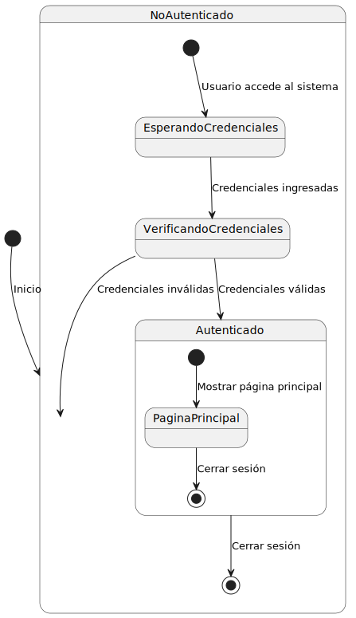

### Diagrama de objetos
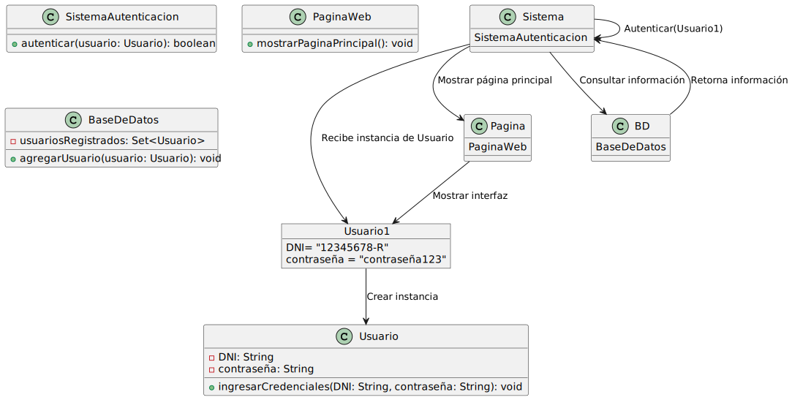

### Diagrama de flujo
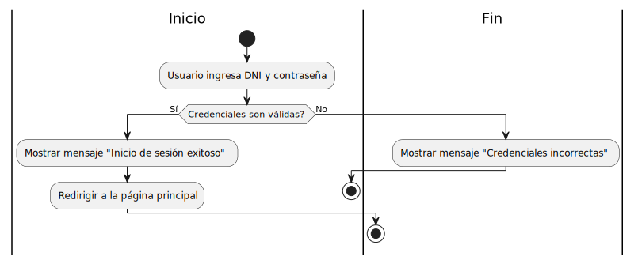

## Caso de uso "[Creación de cuenta](Procesos/CduCreacionDeCuenta)"

## Diagrama de estados
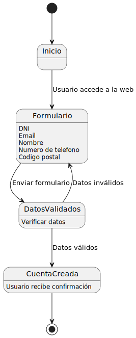

### Diagrama de objetos

### Diagrama de flujo

## Caso de uso "[Reservar](Procesos/CduReservar)"

### Diagrama de estados

### Diagrama de objetos

### Diagrama de flujo
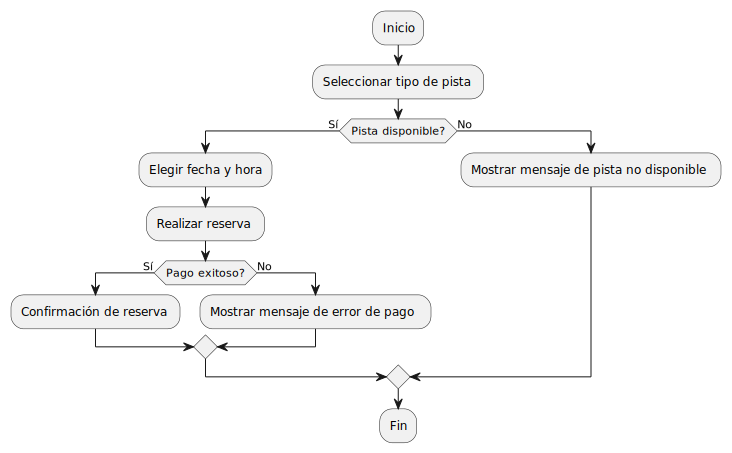

## Caso de uso "[Pagar](Procesos/CduPagar)"

### Diagrama de estados

### Diagrama de objetos
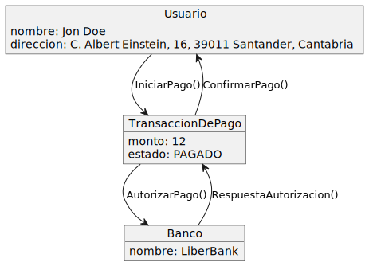

### Diagrama de flujo
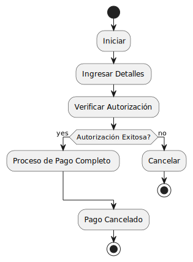

## Caso de uso "[Administrar](Procesos/CduAdministrar)"

### Diagrama de estados

### Diagrama de objetos
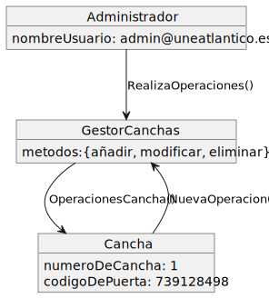

### Diagrama de flujo
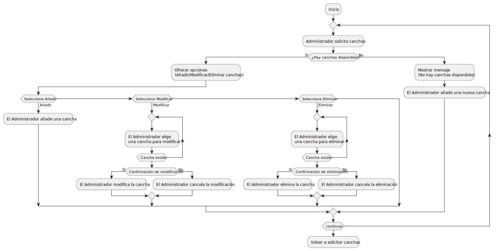

## Caso de uso "[Gestionar](Procesos/CduGestionar)"

### Diagrama de estados
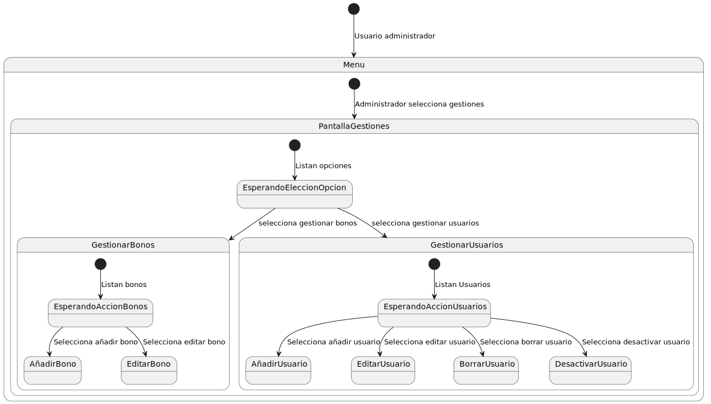

### Diagrama de objetos

### Diagrama de flujo
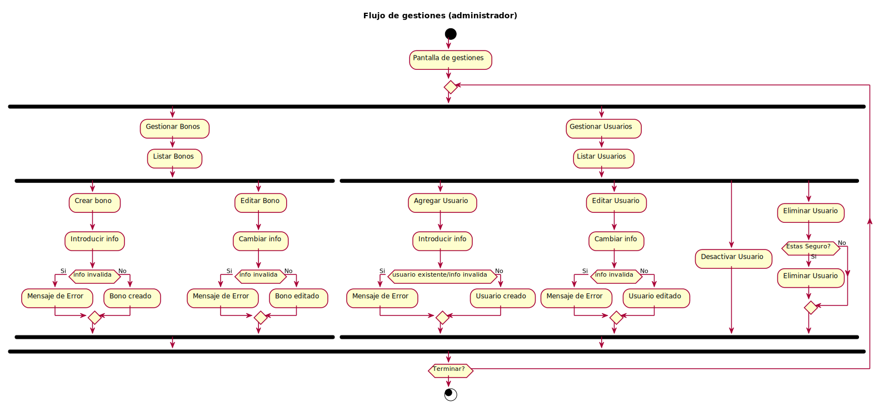

## Caso de uso "[Notificar](Procesos/CduNotificar)"

### Diagrama de estados
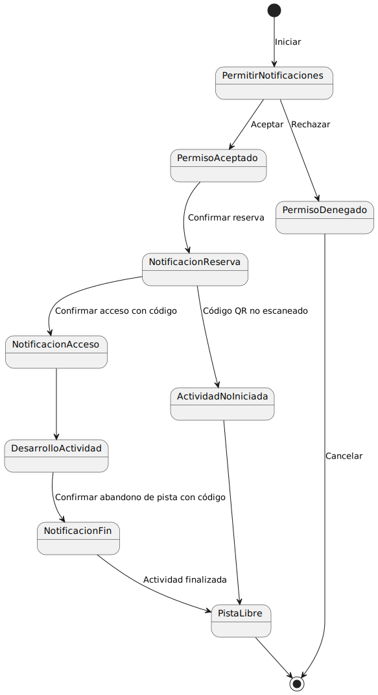

### Diagrama de objetos
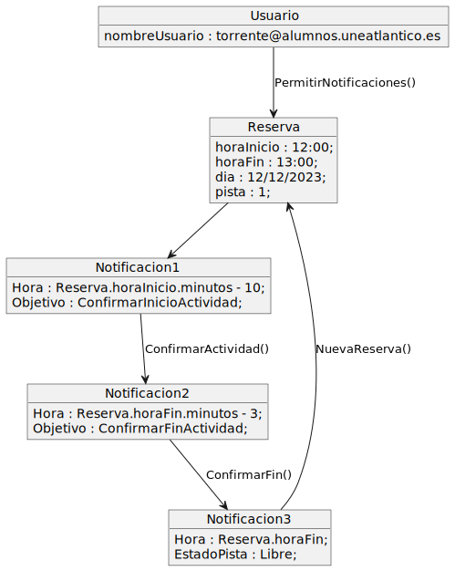

### Diagrama de flujo
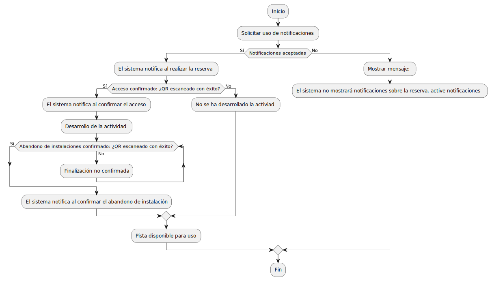

