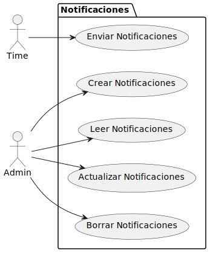
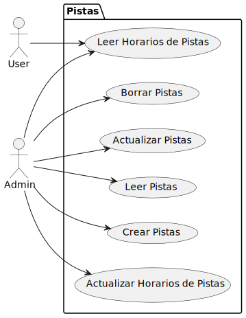
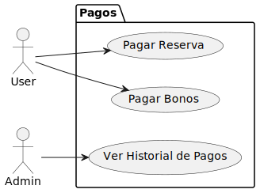
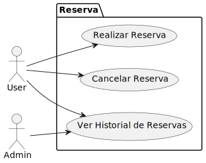
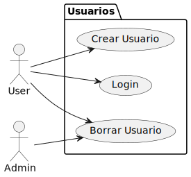

## Actores

| Actor             | Descripción                  |
| ----------------- | ---------------------------- |
| **Administrador** | Gestiona reservas y usuarios |
| **Usuarios**      | Realiza reservas             |
| **Tiempo**        | Termina y notifica reservas  |

## Casos de uso
### Notificaciones
| Imagen                                     |                                 |
| ------------------------------------------ | -------------------------------------- |
|  | [Enlace a la carpeta](CduDetallados/CduNotficaciones) |

### Pistas
| Imagen                                     |                                 |
| ------------------------------------------ | -------------------------------------- |
|  | [Enlace a la carpeta](CduDetallados/CduPistas) |

### Pagos
| Imagen                                     |                                 |
| ------------------------------------------ | -------------------------------------- |
|  | [Enlace a la carpeta](CduDetallados/CduPagos) |

### Reserva
| Imagen                                     |                                 |
| ------------------------------------------ | -------------------------------------- |
|  | [Enlace a la carpeta](CduDetallados/CduReserva) |

### Usuario
| Imagen                                     |                                 |
| ------------------------------------------ | -------------------------------------- |
|  | [Enlace a la carpeta](CduDetallados/Usuario) |

