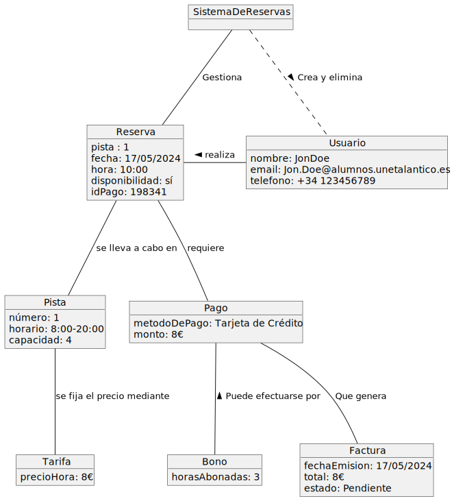
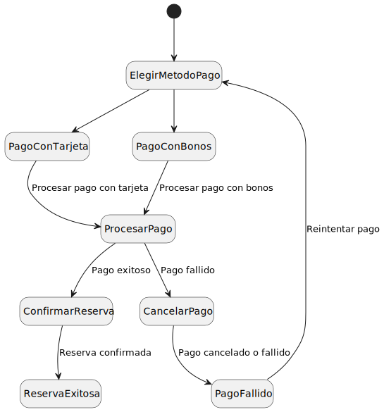
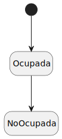
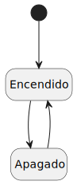
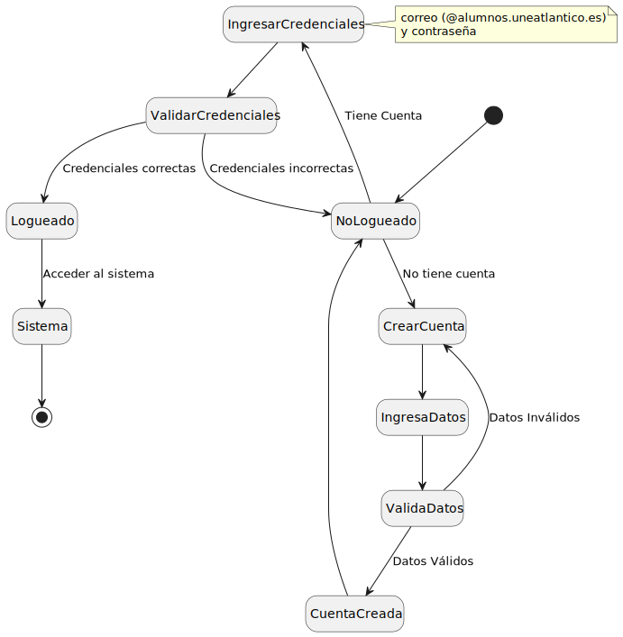

# Modelo de dominio
---
## Glosario

| Palabra       | Definición                                                                                                                                                |
| ------------- | --------------------------------------------------------------------------------------------------------------------------------------------------------- |
| **Usuario**   | Todo aquel que interactúe con la aplicación, ya sea como administrador para gestionarla o como un usuario técnico que desee ver información de las redes. |
| **Registro**  | Espacio virtual donde se deja constancia de un hecho, o el acto de hacer lo mismo                                                                         |
| **Ubicación** | Es el lugar físico en donde se encuentran las pistas de pádel.                                                                                            |
| **Tarifas**   | Precio unitario fijado de forma oficial por el administrador para los servicios brindados.                                                                |
| **Dominio**   | Espacio al cual las personas que quieran hacer uso de las pistas deben pertenecer.                                                                        |
| **Cancelar**  | Anular una reserva                                                                                                                                        |
| **Pista**     | Espacio que el usuario reserva para jugar                                                                                                                 |
| **Bono**      | Código que se puede canjear para obtener un descuento en las reservas                                                                                     |
| **Saldo**     | Cantidad positiva o negativa que resulta de una cuenta.                                                                                                   |

## Requisitos previos

- Pistas de padel
- Usuario/Administrador
- Calendario/Horario
- Tarifas
- Accesos
- Pagos

## Diagrama de clases

|  | 
|  :-----------------------------------------------: |
|      [Código](DiagramaDeClases/DiagramaDeClases.puml)     |

## Diagrama de objetos

|  | 
|  :-----------------------------------------------: |
|      [Código](DiagramaDeObjetos/DiagramaDeObjetos.puml)     |

## Diagrama de estados

| Imagen                                     |                                 |
| ------------------------------------------ | -------------------------------------- |
|  | [Diagrama de estados (Pagos)](ModeloDeDominio/DiagramaDeEstados/Pago/DiagramaEstadosPago.svg) |
|  | [Diagrama de estados (Pista)](DiagramaDeEstados/Pista/DiagramaEstadosPista.svg) |
|  | [Diagrama de estados (Sistema)](ModeloDeDominio/DiagramaDeEstados/Sistema/DiagramaEstadosSistema.svg) |
|  | [Diagrama de estados (Usuario)](ModeloDeDominio/DiagramaDeEstados/Usuario/DiagramaEstadosUsuario.svg) |

