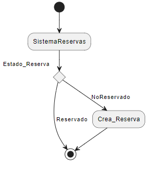

# Proyecto Ingeniería de Software
Repositorio para el proyecto de la asignatura
## Joseph Alemany (Cliente)
# Resumen
- Se desarrolla el modelo del dominio de una problemática propuesta por un cliente, la cual es, poder manejar las reservas de la cancha de padel de la universidad europea del atlantico que sea de facil uso para gestionar las reservas, hacer seguimiento del mismo, realizar cobros de estas reservas e informar al usuario su tiempo limite de uso en las canchas de padel, ademas que todos los usarios deberan pertenecer al mismo dominio.
# Introducción
- Gestionar las reservas de la cancha de padel de la universidad 
# Glosario
| Entidad     | Definición                                                                                                                                                                                                                |
| ----------- | ------------------------------------------------------------------------------------------------------------------------------------------------------------------------------------------------------------------------- |
| Usuario     | Todo aquel que interactúe con la aplicación, ya sea como administrador para gestionarla o como un usuario tecnico que desee ver información de las redes.                                                                 |
| Registro         |Espacio  virtual donde se deja constancia de un hecho, o el acto de hacer lo mismo |
| Ubicación   | Es el lugar físico en donde se encuentran las pistas de padel.                                                                                                                                                                          |
| Tarifas      | Precio unitario fijado de forma oficial el administrador para los servicios brindados.                                                  |                                                                        |                                                                                                        |
| Dominio      | Espacio el cual las personas que quieran hacer uso de las pistas deben pertenecer.                                                                                                                                |

# Requisitos previos
- Pistas de padel
- Usuario/Administrador
- Calendario/Horario
- Tarifas
- Accesos
- Pagos

# Diagrama de Estados de una Reserva
- Diagrama de estados por las que pasa una Reserva

            
  

## Actores y Casos de Uso
# Actores
| Actor                 | Descripción                                    |
| --------------------- | ---------------------------------------------- |
| **Administrador**     | Gestiona reservas y usuarios         |
| **Usuarios**          | Realiza reservas               |

