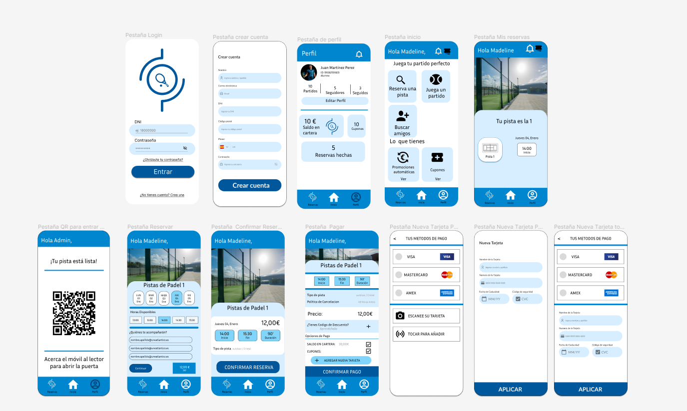

# Proyecto Ingeniería de Software

### Joseph Alemany (Cliente)

---

## Descripción

- Se desarrolla el modelo del dominio de una problemática propuesta por un cliente, la cual es, poder manejar las reservas de la cancha de padel de la universidad europea del atlantico que sea de facil uso para gestionar las reservas, hacer seguimiento del mismo, realizar cobros de estas reservas e informar al usuario su tiempo limite de uso en las canchas de padel, ademas que todos los usarios deberan pertenecer al mismo dominio.

## Recursos clave
- [Modelo de Dominio](ModeloDeDominio)
- [Casos de Uso](CasosDeUso)
- [Prototipos de interfaz](https://www.figma.com/file/MpId1d2MqM2VkYzj57Lq8v/MockUp?type=design&node-id=0%3A1&mode=design&t=yik5d5ON9Fbw465y-1) (ver en figma)

---
---

